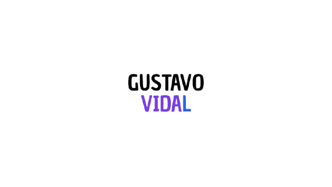

<div align="center">



# Gustavo Vidal de Abreu

### 🖥️ Back-End Developer

[](https://www.linkedin.com/in/gustavvidal/)
[](https://github.com/gustavidal)
[](mailto:gustavovidalgva@gmail.com)

</div>

---

## 👨‍💻 Sobre o Projeto

Portfólio pessoal desenvolvido do zero com HTML, CSS e JavaScript puro. O site apresenta minha trajetória, stack técnica e projetos de forma clean, responsiva e com suporte a **modo escuro** e **tradução PT/EN**.

> 🔗 **[Acessar portfólio](https://gustavidal.github.io/portfolio/)**

---

## ✨ Funcionalidades

- 🌙 **Modo escuro / claro** — com persistência via `localStorage`
- 🌐 **Tradução PT ↔ EN** — alternância dinâmica de idioma
- 📱 **Responsivo** — adaptado para mobile, tablet e desktop
- 🎞️ **Slideshow** — troca automática de fotos no hero
- 🧭 **Menu mobile** — hamburguer funcional para telas pequenas
- ⚡ **Sem frameworks** — JavaScript puro, rápido e leve

---

## 🛠️ Stack do Projeto


---

## 💡 Tecnologias que Estudo


---

## 📁 Estrutura do Projeto

```
portfolio/
├── 📄 index.html
├── 📜 main.js
├── 📂 css/
│   ├── reset.css
│   └── style.css
└── 📂 img/
    ├── logo.png
    ├── 📂 profile/
    │   ├── img1.jpg
    │   ├── img2.jpg
    │   └── img3.jpg
    └── 📂 svg/
        └── icon.svg
```

---

## 🚀 Como Rodar Localmente

```bash
# Clone o repositório
git clone https://github.com/gustavidal/portfolio.git

# Acesse a pasta
cd portfolio

# Abra no navegador
# Basta abrir o arquivo index.html no seu navegador preferido
# ou usar a extensão Live Server no VS Code
```

---

## 📬 Contato

Quer bater um papo ou tem algum projeto em mente?

- 📧 **E-mail:** [gustavovidalgva@gmail.com](mailto:gustavovidalgva@gmail.com)
- 💼 **LinkedIn:** [linkedin.com/in/gustavvidal](https://www.linkedin.com/in/gustavvidal/)
- 🐙 **GitHub:** [github.com/gustavidal](https://github.com/gustavidal)

---

<div align="center">

Feito com 💙 por **Gustavo Vidal de Abreu**

</div>
