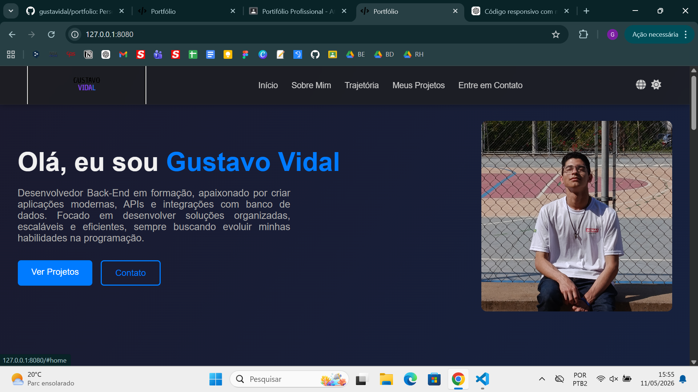
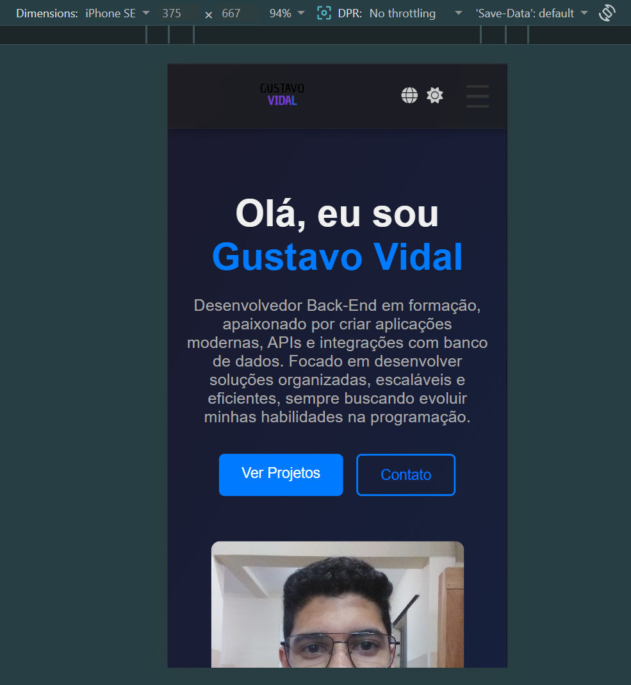

# 🚀 Portfólio — Gustavo Vidal de Abreu

<p align="center">
  <strong>Portfólio moderno, responsivo e multilíngue desenvolvido com HTML, CSS e JavaScript.</strong>
</p>

<p align="center">
  
  
  
  
</p>

---

# 📖 Sobre o Projeto

Este projeto foi desenvolvido com o objetivo de demonstrar minhas habilidades técnicas e organizacionais no desenvolvimento de um projeto real.

Além da programação, o foco principal foi praticar:

* 📅 Gestão de prazos
* 📌 Organização de tarefas
* 👥 Divisão de responsabilidades
* 🧠 Planejamento de funcionalidades
* 🛠️ Estruturação de projeto
* 🚀 Entrega de uma aplicação completa

O portfólio também representa minha evolução como desenvolvedor Back-End em formação, reunindo projetos, tecnologias, trajetória acadêmica e formas de contato profissional.

Além disso, o site foi construído com foco em:

* 🎨 Design moderno
* 📱 Responsividade
* 🌙 Dark Mode
* 🌎 Tradução PT/EN
* ⚡ Performance
* ✨ Animações suaves

---

# 🖼️ Preview

## 💻 Desktop

<p align="center">
  
</p>

## 📱 Mobile

<p align="center">
  
</p>

---

# 🛠️ Tecnologias Utilizadas

## Front-End

* HTML5
* CSS3
* JavaScript

## Bibliotecas

* Font Awesome
* Devicon
* Google Fonts

---

# ✨ Funcionalidades

## 🎞️ Slideshow de imagens

Troca automática das imagens da seção principal.

## 🌙 Dark Mode

Alternância entre tema claro e escuro com salvamento no `localStorage`.

## 🌎 Tradução PT/EN

Sistema de tradução dinâmica utilizando atributos `data-*`.

## 📱 Responsividade

Layout adaptado para:

* Desktop
* Tablets
* iPad Mini
* Smartphones
* iPhone SE

## ✨ Scroll Animation

Animações suaves conforme os elementos entram na tela.

## 🔥 Navbar Blur

Navbar moderna utilizando `backdrop-filter`.

---

# 📂 Estrutura do Projeto

```
📁 portfolio
 ┣ 📂 css
 ┃ ┣ 📄 reset.css
 ┃ ┗ 📄 style.css
 ┣ 📂 img
 ┃ ┣ 📂 profile
 ┃ ┃ ┣ 📸 img1.jpg
 ┃ ┃ ┣ 📸 img2.jpg
 ┃ ┃ ┗ 📸 img3.jpg
 ┃ ┣ 📂 readme
 ┃ ┃ ┣ 📸 desktop-preview.png
 ┃ ┃ ┗ 📸 mobile-preview.png
 ┃ ┣ 📂 svg
 ┃ ┃ ┗ 📸 icon.svg
 ┃ ┗ 📸 logo.png
 ┣ 📄 index.html
 ┣ 📄 LICENSE
 ┣ 📄 main.js
 ┗ 📄 README.md
```

---

# 🚀 Como Executar

## 1️⃣ Clone o repositório

```bash
git clone https://github.com/gustavidal/portfolio.git
```

## 2️⃣ Abra o projeto

Abra o arquivo:

```bash
index.html
```

---

# 📸 Recursos Visuais

* Glassmorphism
* Hover Effects
* Grid Layout
* Smooth Transitions
* Mobile Navigation
* Timeline UI
* Project Cards

---

# 📚 Aprendizados

Durante o desenvolvimento deste projeto, pratiquei:

* Responsividade avançada
* Manipulação do DOM
* Organização de CSS
* Estruturação de projetos Front-End
* Animações com JavaScript
* Boas práticas visuais
* UX/UI

---

# 📬 Contato

## 👨‍💻 Gustavo Vidal de Abreu

* GitHub: [https://github.com/gustavidal](https://github.com/gustavidal)
* LinkedIn: [https://www.linkedin.com/in/gustavvidal/](https://www.linkedin.com/in/gustavvidal/)
* Email: [gustavovidalgva@gmail.com](mailto:gustavovidalgva@gmail.com)

---

# ⭐ Considerações Finais

Este projeto representa minha evolução como desenvolvedor e continuará recebendo melhorias ao longo da minha trajetória.

Caso tenha gostado do projeto, considere deixar uma ⭐ no repositório.